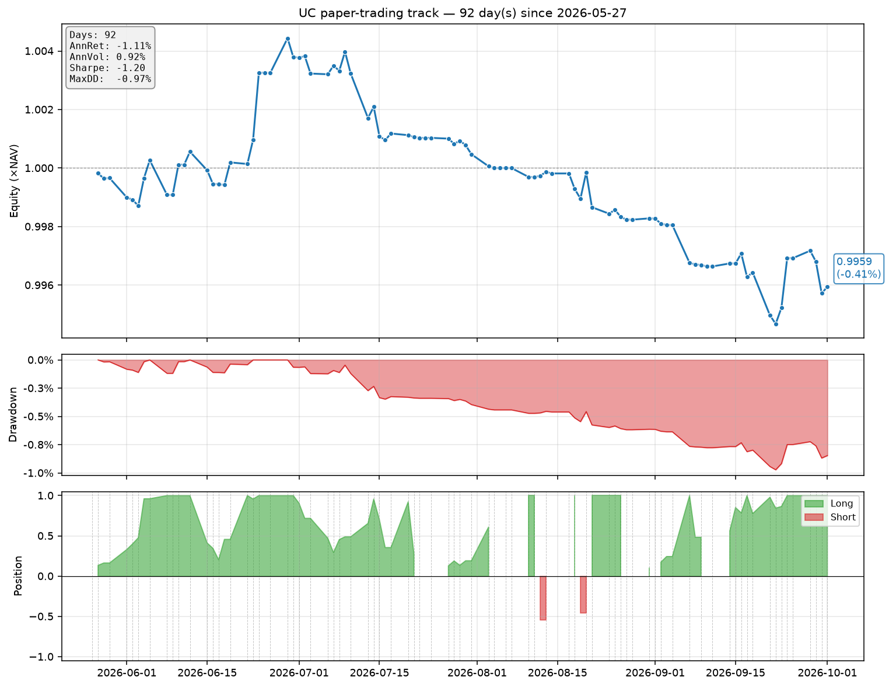

# UC Paper-Trading Live Track

_Last update_: `2026-09-29 01:47 UTC`

## Latest signal

- **As-of close**: `2026-09-28 00:00:00` (close = `6.7128`)
- **Effective trading day**: `2026-09-29 00:00:00`
- **Composite signal**: `+1.2831`
- **Target position**: `+1.0000`  (LONG)
- **In market**: `True`
- **Deadband**: threshold=`0.2`, mode=`soft`

## Live performance

- **Signals recorded**: 73
- **Trading days observed**: 89 (since 2026-05-27)
- **Cumulative return**: `-0.28%`
- **Annualised return**: `-0.80%`
- **Annualised volatility**: `0.92%`
- **Sharpe ratio**: `-0.87`
- **Sortino ratio**: `-1.20`
- **Max drawdown**: `-0.97%`
- **Calmar**: `-0.82`
- **Win rate (non-flat days)**: `35.1%`
- **Best day**: `+0.2284%`
- **Worst day**: `-0.1510%`
- **In-market fraction**: `84.3%`

## Active factor set

`bitcoin_momentum`, `copper_momentum`, `dxy_momentum`, `gold_momentum`, `rate_diff_level`, `vix_change`

## Track-record chart

## Files

- `signals/history.csv` — append-only signal log
- `signals/latest.json` — latest signal in pretty form
- `signals/paper_pnl.csv` — realised daily PnL series
- `signals/stats.json` — machine-readable performance metrics
- `signals/track.png` — live equity / drawdown / position chart

---

_Paper-trading only. Uses `CNY=X` (in-shore) as a proxy for SGX UC futures; real-life UC PnL will differ by the CNY/CNH basis._